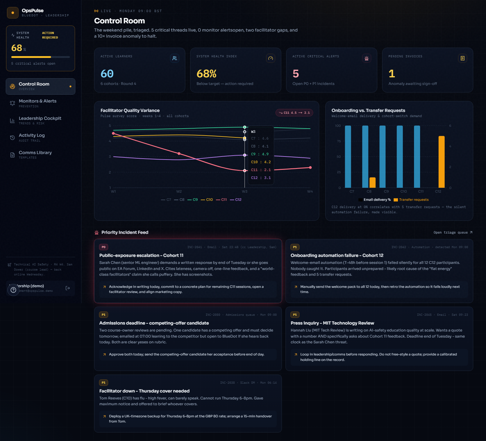
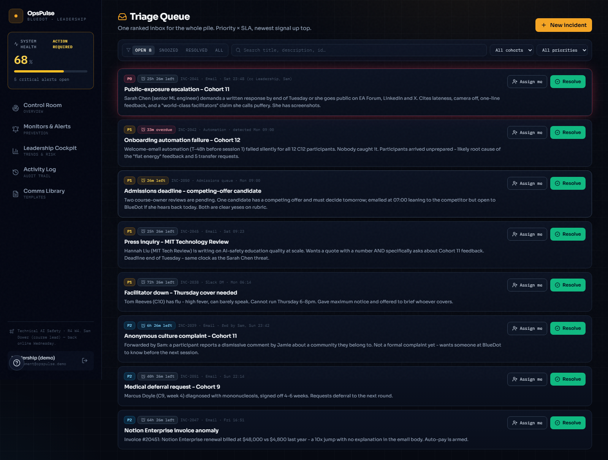
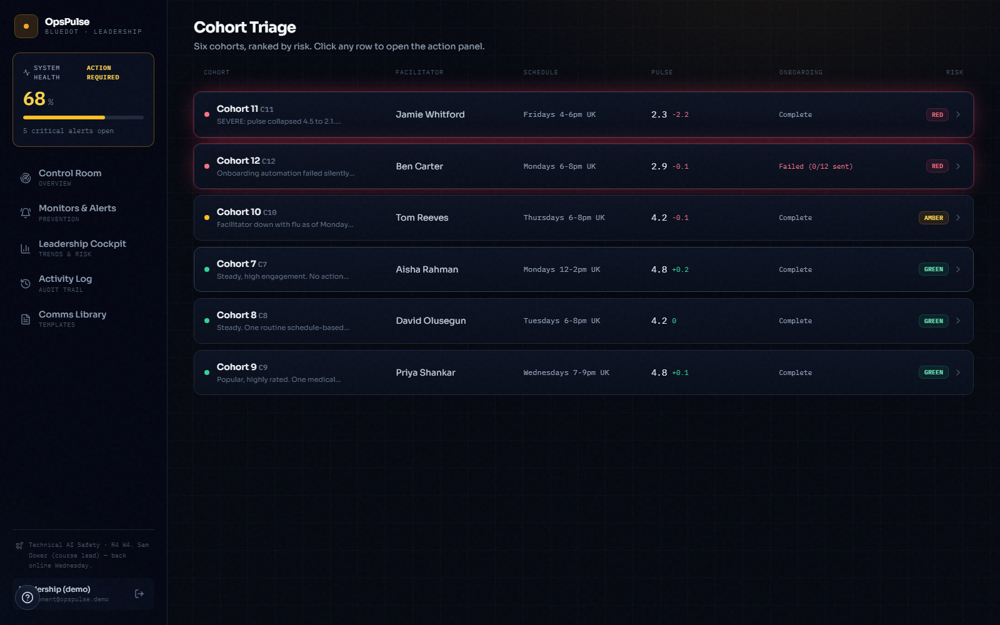
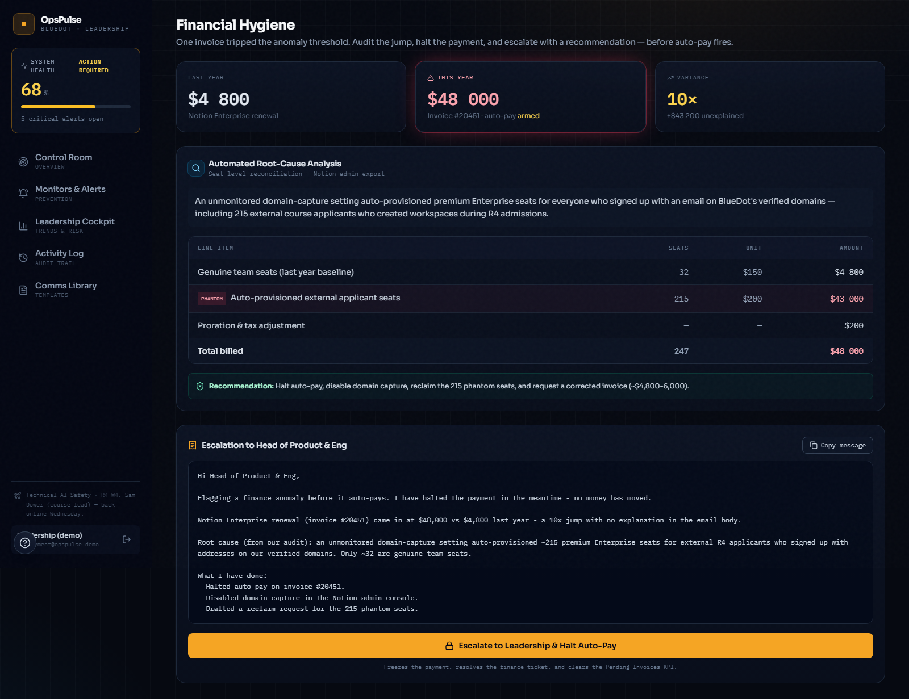
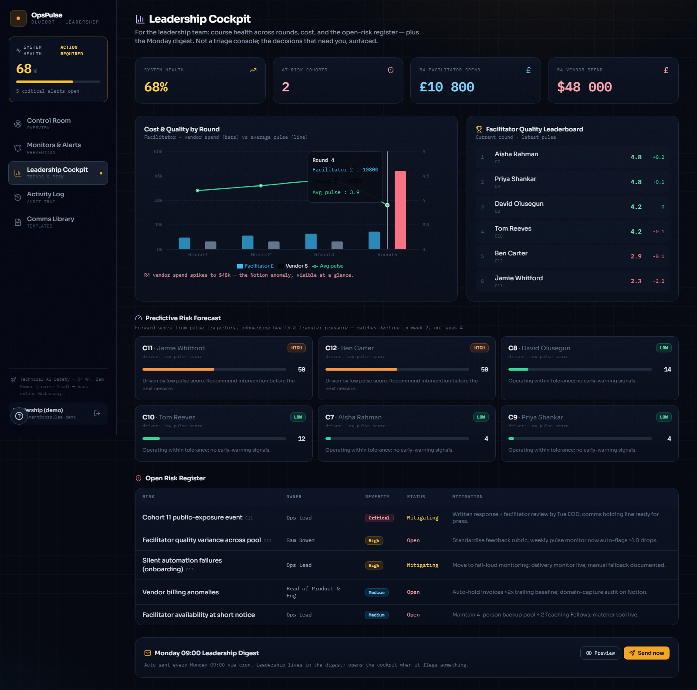

# BlueDot OpsPulse — Portal & Control Room

A full-stack internal **operations control room** for course operations. It turns the Monday-morning pile — facilitator emergencies, at-risk cohorts, reputation escalations, and financial anomalies — into a single triaged surface where the Course Operations Lead can *see* the state of the round and *act* on it, with every action persisted, audited, and reflected live across the team.

Built around the **Technical AI Safety** course scenario (Round 4, Week 4 of 5, 60 participants, 6 cohorts), but the model generalises to any course.

**▶ Live demo:** [bluedot-opspulse.vercel.app](https://bluedot-opspulse.vercel.app) — one click to enter as **Ops Lead** or **Management** (no signup).

> **Work-test framing.** This dashboard is a supplementary artifact built to show how I would operationalise the Monday sweep. The Google Doc / Notion submission remains the source of truth for the required written answer.



---

## Executive summary

> **The problem.** When the course lead is unreachable, operational signal is scattered across email, Slack, pulse surveys, an admissions queue, and billing. A silent automation failure or a single furious participant can sit unseen for 48 hours and become a public-reputation event. There is no single place that answers *"how healthy is the round right now, and what needs me first?"*

**OpsPulse answers that in one screen.** A weighted **System Health Index** aggregates every open incident by severity, so the state of the round is readable at a glance. From there the operator moves from signal to resolution without leaving the tab — and leadership gets a separate cockpit plus a Monday digest, never the firehose.

Two shifts make it more than a dashboard:

- **Pull → push.** Continuous monitors catch the *silent* failures (a pulse collapse, a 0%-delivery onboarding, a 10× invoice) and raise them *before* Monday — the C12 onboarding gap would have alerted Thursday, not festered to 9am.
- **Read → act, with memory.** Every action (resolve, deploy cover, halt auto-pay) persists to Postgres, appends to an audit trail, and recomputes the metrics in real time across every open session.

| Module | What it does |
| --- | --- |
| **Control Room** | Monday Decision Brief, KPIs, quality-variance & onboarding charts, live P0/P1 feed |
| **Triage Queue** | One ranked inbox: priority × SLA timers, notes, snooze, manual creation |
| **Cohort Triage** | Risk-ranked grid + calibrated action drawers (pause pending review + deploy cover; remedy onboarding) |
| **Backup Matcher** | Timezone/availability-aware facilitator scheduling (£80 rate) with a generated calendar invite |
| **Financial Hygiene** | Invoice hold, vendor verification, and a cautious working hypothesis before escalation |
| **Monitors & Alerts** | Prevention rules with seeded preview findings when no live alerts exist |
| **Systemic Fix** | Monday Course Health Sweep checklist, RAG rules, and automation-failure runbook |
| **Leadership Cockpit** | Round-over-round trends, cost, facilitator leaderboard, **predictive risk**, risk register, Monday digest |
| **Drafts Shipped + Activity Log** | Actual work-test comms drafts and a full who-did-what audit trail |

---

## Screenshots

**Triage Queue** — one ranked inbox, live SLA countdowns, search & filters.


**Cohort Triage** — six cohorts ranked by risk, click to open the action drawer.


**Financial Hygiene** — vendor verification plus a seat-level working hypothesis on the 10× invoice.


**Leadership Cockpit** — trends, cost, predictive risk forecast, risk register, digest.


---

## Tech stack

| Layer | Choice |
| --- | --- |
| **Framework** | Next.js 16 (App Router, Server Components + Server Actions) |
| **Language** | TypeScript (strict) on React 19 / Node 24 LTS |
| **Database / Auth / Realtime** | Supabase (Postgres + Row Level Security + Realtime) |
| **Styling** | Tailwind CSS — custom dark "mission-control" theme |
| **Charts / Icons** | Recharts · Lucide React |
| **Email / Calendar** | Resend · `ics` (both graceful — simulate cleanly without keys) |
| **Fonts** | Sora (display) + IBM Plex Mono (metrics) via `next/font` |
| **Quality** | Vitest (unit) · Playwright (e2e) · GitHub Actions CI · security headers + CSP |
| **Hosting** | Vercel (auto-deploy on push) |

### Architecture
- **Server Components** read data through Supabase with RLS (authenticated read).
- **Mutations run as Server Actions** using a service-role client that (1) writes the row, (2) appends an `actions_log` audit entry, (3) fires any integration, (4) revalidates. **Realtime** subscriptions push queue/alert changes to every client.
- `middleware.ts` gates auth; `/cockpit` is management-only.
- **System Health = 100 − Σ(health_impact of open incidents)** — a single dynamic number that every action moves.
- **Graceful degradation:** Slack/email/calendar integrations send for real when keys are present and simulate (with a `DEMO` tag) when they aren't, so the deployed app works with zero external accounts.

---

## Getting started

```bash
# 1. Install
npm install

# 2. Configure Supabase (free project)
cp .env.example .env.local        # then fill in your Supabase URL + keys
# Run supabase/schema.sql in the Supabase SQL Editor, then:
node scripts/seed-users.mjs       # creates the two demo accounts

# 3. Develop
npm run dev                       # http://localhost:3000

# 4. Quality gates
npm run lint && npm run typecheck && npm run test && npm run build
```

Optional env (`.env.local`): `RESEND_API_KEY` + `DIGEST_TO` to send real email, `SLACK_WEBHOOK_URL` to post real Slack alerts. Omit them and those actions simulate cleanly.

---

## Project structure

```
src/
├── app/
│   ├── (app)/            # authed shell: control room, queue, triage, backup,
│   │                     #   finance, alerts, systemic fix, cockpit, activity, drafts
│   ├── login/            # auth + one-click demo logins
│   └── api/cron/         # scheduled monitors + weekly digest (Vercel Cron)
├── components/           # view components, nav, hooks, welcome tour
├── lib/
│   ├── supabase/         # server / admin / browser clients
│   ├── actions.ts        # server actions (write + audit + integrate + revalidate)
│   ├── data.ts           # server-side reads
│   ├── sla.ts            # health, SLA, ranking (unit-tested)
│   ├── monitors.ts       # prevention rules engine (unit-tested)
│   ├── risk.ts           # predictive risk scoring (unit-tested)
│   ├── workTestBrief.ts  # static decision brief, shipped drafts, health sweep
│   └── integrations/     # slack / email / calendar (graceful degradation)
├── middleware.ts         # auth gating + session refresh
└── supabase/             # schema.sql + migrations + seed scripts
```

---

## Quality

- **24 unit tests** (Vitest) covering the pure logic — health/SLA, the monitors engine, the digest composer, and the predictive-risk scorer.
- **Playwright** smoke test for the auth → triage → resolve flow.
- **GitHub Actions CI** runs typecheck + tests + build on every push.
- **Accessibility:** keyboard focus rings, skip link, `role="dialog"` + Escape on every overlay, ARIA-labelled controls, described charts, reduced-motion support.
- **Security headers:** CSP (scoped for Supabase REST + Realtime), HSTS, X-Frame-Options, X-Content-Type-Options, Referrer-Policy, Permissions-Policy.
- Fully **mobile-responsive**; a **welcome tour** and one-click **demo reset** make it friendly to first-time reviewers.

---

## Roadmap

- **Live signal:** Customer.io webhooks for real-time email-delivery events; a pulse-survey API feeding the variance chart.
- **AI triage:** an LLM classifies each inbound, assigns priority + cohort, and drafts a calibrated first response for the operator to review and ship.
- **Deeper prediction:** blend attendance and facilitator history into the risk score; auto-route deadline-sensitive admissions as SLA-timed tasks.

---

> **Note on data.** Self-contained demo. All names and figures are seeded mock data dramatised from a course-operations scenario; no live systems are connected. The *interactions* are real (state persists, metrics recompute, audit is recorded) — the outbound integrations are simulated unless keys are supplied.

*Built as a supplementary dashboard artifact for a Course Operations Lead work test.*
